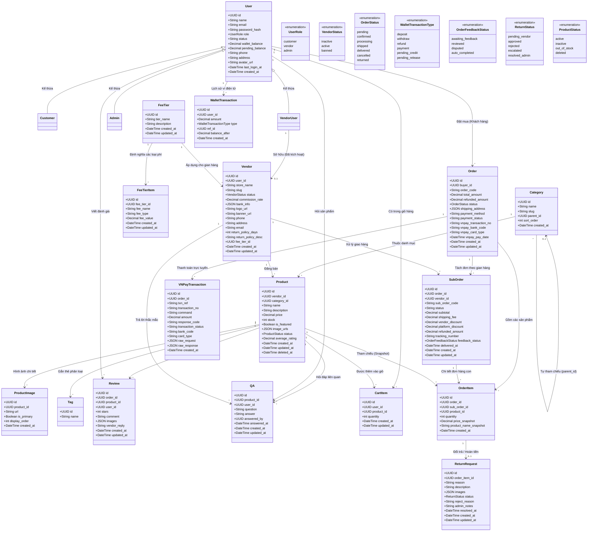
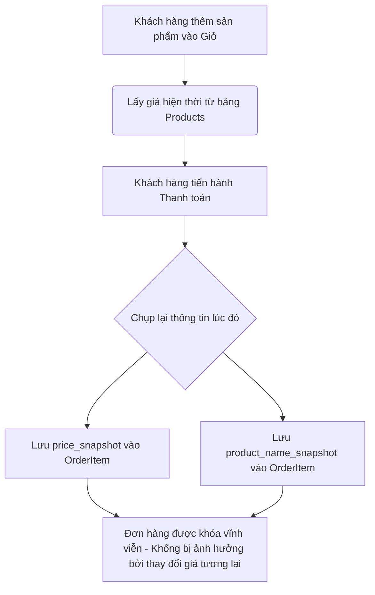

# Hệ thống ReShop - Sơ đồ Lớp Tổng thể (Overall Class Diagram)

Tài liệu này cung cấp bản thiết kế cấu trúc tĩnh toàn diện của hệ thống **ReShop**, thể hiện chi tiết các thực thể dữ liệu, thuộc tính, kiểu dữ liệu, các quan hệ ràng buộc và các cơ chế logic cốt lõi đảm bảo tính toàn vẹn dữ liệu.

---

## 1. Sơ đồ Lớp Tổng thể (Mermaid Class Diagram)

Dưới đây là sơ đồ chi tiết các lớp dữ liệu và các mối quan hệ liên kết trong hệ thống ReShop:

---

## 2. Phân tích Chi tiết các Logic Ràng buộc Cốt lõi

### 2.1 Lớp Người dùng đa vai trò & Gian hàng (Vendor)
* **Kế thừa vai trò (Inheritance):** Hệ thống phân cấp `User` làm lớp cơ sở chứa các thông tin tài khoản chung. Các lớp `Customer` (Khách hàng), `VendorUser` (Người bán) và `Admin` (Quản trị viên) kế thừa trực tiếp từ `User`.
* **Quan hệ ràng buộc 1 - 0..1:** Mối liên kết giữa `User` (cụ thể là `VendorUser`) và `Vendor` (Gian hàng) được thiết lập thông qua khóa ngoại `user_id` (được đánh chỉ mục UNIQUE).
* **Quy trình kích hoạt:** 
  > [!IMPORTANT]
  > Để kích hoạt gian hàng, người dùng bắt buộc phải có vai trò `vendor`. Khi vừa tạo mới, trạng thái mặc định của gian hàng sẽ là `inactive` (chờ kiểm duyệt). Chỉ sau khi Admin phê duyệt thành công, trạng thái mới chuyển sang `active` và cho phép đăng bán sản phẩm.

### 2.2 Cấu trúc Cây danh mục không giới hạn (Self-Referencing)
* **Mô hình tự tham chiếu:** Lớp `Category` (Danh mục) tự liên kết với chính nó thông qua trường `parent_id` (kiểu UUID).
* **Cơ chế hoạt động:** 
  * Danh mục cấp cao nhất có `parent_id = NULL`.
  * Các danh mục con cấp dưới lưu `parent_id` trỏ đến danh mục cha.
  * Cơ chế này hỗ trợ thiết lập cây danh mục cầu lông với độ sâu vô hạn (ví dụ: *Vợt cầu lông -> Vợt Yonex -> Yonex Astrox*).

### 2.3 Liên kết Sản phẩm và các Thực thể vệ tinh
* Một đối tượng `Product` đóng vai trò trung tâm liên kết với nhiều thực thể vệ tinh theo mối quan hệ `1 - n`:
  * **Hình ảnh (ProductImage):** Quản lý bộ sưu tập ảnh của sản phẩm, trong đó có một ảnh được thiết lập `is_primary = TRUE` làm ảnh đại diện.
  * **Tag (Nhãn phân loại):** Phân nhóm sản phẩm theo nhu cầu riêng.
  * **Đánh giá (Review):** Khách mua hàng để lại nhận xét và số sao (1-5), đồng thời người bán có thể phản hồi (`vendor_reply`).
  * **Hỏi đáp & Phản hồi (QA):** Khách hàng đặt câu hỏi công khai và người bán trả lời.

---

## 3. Điểm sáng Kỹ thuật: Cơ chế Snapshot của OrderItem

> [!TIP]
> **Cơ chế Snapshot lịch sử đơn giá & thông tin sản phẩm**
> Để đảm bảo tính toàn vẹn dữ liệu tài chính và bảo vệ lịch sử giao dịch trước mọi thay đổi trong tương lai (khi người bán đổi giá, đổi tên hoặc xóa sản phẩm), hệ thống áp dụng cơ chế chụp ảnh dữ liệu (Snapshot) tại đúng thời điểm thanh toán.

* **OrderItem:** Chứa hai trường snapshot quan trọng:
  * `price_snapshot`: Lưu mức giá tại thời điểm đặt hàng.
  * `product_name_snapshot`: Lưu tên sản phẩm tại thời điểm đặt hàng.
* Mối liên hệ: `OrderItem` trỏ đến `Product` thông qua `product_id` (ràng buộc `ON DELETE RESTRICT` để tránh mất dữ liệu liên kết vật lý), đồng thời lưu giá trị snapshot độc lập.

---

## 4. Quản lý Luồng giao dịch, Hóa đơn và Ví điện tử

* **Hóa đơn và Vận chuyển (Sub-Orders):** 
  * Một đơn hàng lớn `Order` gồm nhiều sản phẩm từ các shop khác nhau sẽ được tự động chia nhỏ thành các `SubOrder` (Đơn hàng con) theo từng `Vendor`.
  * Mỗi `SubOrder` có thông tin vận chuyển, mã vận đơn `tracking_number`, phí giao hàng `shipping_fee` riêng và có thể xuất hóa đơn PDF độc lập.
* **Luồng giao dịch (WalletTransaction & VNPayTransaction):**
  * **VNPayTransaction:** Ánh xạ các thông tin thanh toán online qua cổng VNPAY. Lưu trữ chi tiết phản hồi kết quả giao dịch và mã giao dịch hệ thống ngân hàng.
  * **WalletTransaction:** Quản lý ví điện tử của người dùng và nhà bán hàng. Hỗ trợ ghi nhận các loại giao dịch: đặt cọc (`deposit`), rút tiền (`withdraw`), hoàn tiền (`refund`), thanh toán (`payment`), tạm giữ doanh thu (`pending_credit`, `pending_release`).
