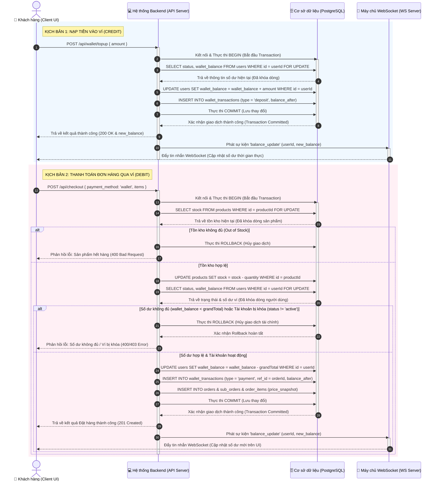
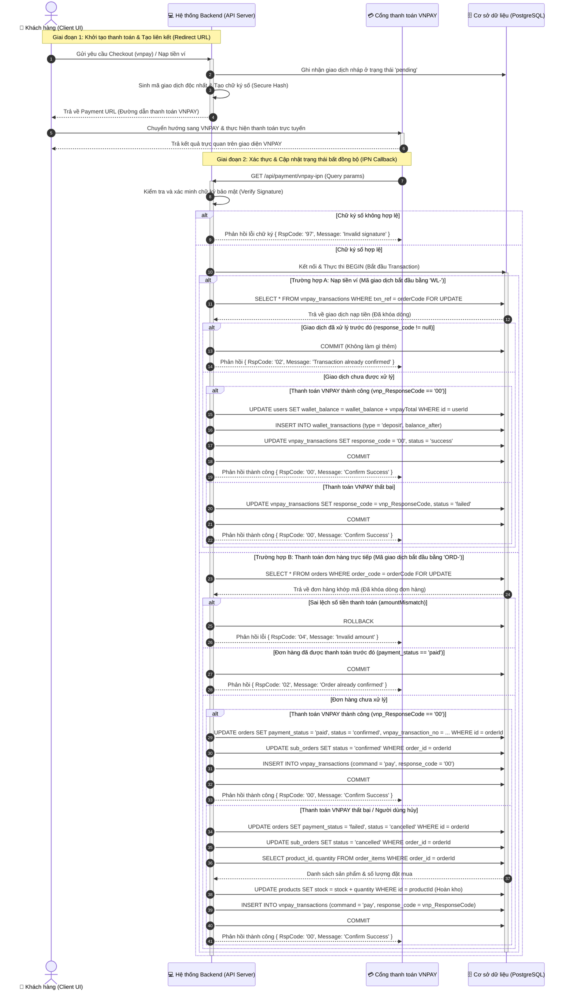

# Hệ thống ReShop - Sơ đồ Trình tự Thanh toán trực tuyến & Ví điện tử (Sequence Diagram)

Tài liệu này mô tả chi tiết các luồng trình tự (Sequence Diagram) của **Hệ thống Thanh toán trực tuyến** và **Ví điện tử ảo** thuộc nền tảng ReShop, bao gồm cả luồng giao tiếp nội bộ và luồng tương tác với cổng thanh toán VNPAY.

---

## 1. Sơ đồ Trình tự Ví điện tử ảo (Nạp tiền & Trừ tiền)

Sơ đồ dưới đây thể hiện chi tiết cơ chế khóa dòng dữ liệu tài chính (`FOR UPDATE`), rẽ nhánh kiểm tra số dư (`ROLLBACK`/`COMMIT`) và đồng bộ thời gian thực qua `WebSocket`:

---

## 2. Sơ đồ Trình tự Thanh toán trực tuyến qua cổng VNPAY

Dưới đây là luồng xử lý giao dịch thanh toán trực tuyến qua cổng VNPAY, bao gồm cả hai nhánh: **Nạp tiền ví (WL-)** và **Thanh toán trực tiếp đơn hàng (ORD-)** thông qua kênh xử lý bất đồng bộ IPN (Server-to-Server) nhằm bảo vệ tính toàn vẹn dữ liệu:

---

## 3. Các Logic Ràng buộc Kỹ thuật của Thanh toán VNPAY

### 3.1 Tránh xử lý trùng lặp (Idempotency)
Hệ thống sử dụng cơ chế kiểm tra trạng thái trước khi xử lý:
* Đối với Ví: Kiểm tra `vnpay_transactions.response_code IS NOT NULL`.
* Đối với Đơn hàng: Kiểm tra `orders.payment_status = 'paid'`.
> [!IMPORTANT]
> Cơ chế kiểm tra này kết hợp với khóa dòng `FOR UPDATE` giúp loại bỏ hoàn toàn rủi ro cộng tiền/xác nhận đơn hàng hai lần khi cổng thanh toán VNPAY gửi nhiều thông báo IPN trùng lặp cho cùng một giao dịch.

### 3.2 Khôi phục tồn kho khi giao dịch thất bại
* Khác với hình thức thanh toán COD (nhận hàng trả tiền) hoặc ví điện tử (trừ tiền tức thì), thanh toán qua cổng ngoài (VNPAY) có độ trễ lớn và rủi ro người dùng huỷ thanh toán tại trang cổng.
* Do đó, khi tạo đơn hàng, hệ thống đã trừ tồn kho tạm thời. Nếu nhận được IPN báo lỗi hoặc huỷ giao dịch, hệ thống sẽ thực hiện truy vấn các `order_items` tương ứng và thực hiện **hoàn trả tồn kho** (`stock = stock + quantity`) để đảm bảo không bị thất thoát số lượng sản phẩm bán thực tế của các shop.
