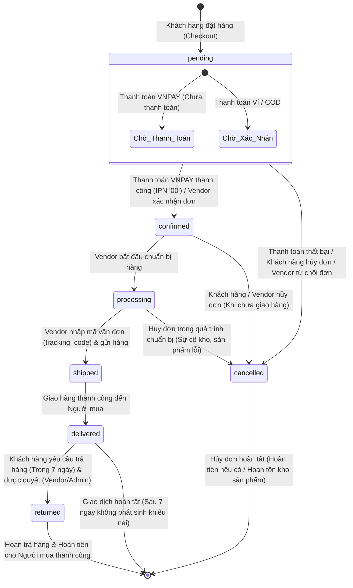

# Hệ thống ReShop - Sơ đồ Chuyển Trạng thái Đơn hàng (State Diagram)

Tài liệu này mô tả chi tiết các trạng thái và luồng chuyển trạng thái (State Transition) của đối tượng **Đơn hàng (Order)** trong hệ thống ReShop dựa trên phân tích logic từ các controller (`checkout.controller.ts`, `vendor.controller.ts`, `admin-dispute.controller.ts`).

---

## 1. Sơ đồ Chuyển Trạng thái (Mermaid State Diagram)

Dưới đây là sơ đồ trạng thái mô tả vòng đời của một Đơn hàng từ khi khởi tạo cho đến khi kết thúc (Thành công, Hủy hoặc Trả hàng):

---

## 2. Mô tả Chi tiết các Trạng thái & Điều kiện Chuyển đổi

### 2.1 Trạng thái khởi đầu (`pending`)
* **Mô tả:** Đơn hàng được tạo thành công trên hệ thống. 
* **Nhánh xử lý:**
  * Nếu chọn thanh toán qua **VNPAY**: Đơn hàng ở trạng thái chờ xác nhận từ cổng thanh toán.
  * Nếu chọn thanh toán qua **Ví điện tử** hoặc **COD**: Đơn hàng chờ Vendor xác nhận chuẩn bị hàng.

### 2.2 Trạng thái đã xác nhận (`confirmed`)
* **Điều kiện chuyển đổi:**
  * Hệ thống nhận được IPN phản hồi giao dịch thành công (`vnp_ResponseCode == '00'`) từ VNPAY.
  * Hoặc Vendor duyệt đơn hàng từ màn hình quản lý (đối với thanh toán Ví/COD).
* **Đặc tính:** Đơn hàng chính thức hợp lệ và chuyển sang khâu xử lý tiếp theo.

### 2.3 Trạng thái đang chuẩn bị hàng (`processing`)
* **Điều kiện chuyển đổi:** Vendor chọn bắt đầu xử lý đơn hàng.
* **Mô tả:** Các sản phẩm trong đơn được chuẩn bị và đóng gói tại kho của Vendor.

### 2.4 Trạng thái đang giao hàng (`shipped`)
* **Điều kiện chuyển đổi:** Vendor cập nhật trạng thái kèm theo **Mã vận đơn (tracking_code)** hợp lệ.
* **Mô tả:** Đơn hàng đã được bàn giao cho đơn vị vận chuyển để giao tới Người mua.

### 2.5 Trạng thái đã giao hàng (`delivered`)
* **Điều kiện chuyển đổi:** Xác nhận người mua đã nhận được hàng.
* **Mô tả:** Đơn hàng giao thành công. Lúc này, tiền thanh toán của người mua sẽ được cộng vào số dư đóng băng (`pending_balance`) của Vendor.

### 2.6 Trạng thái đã hủy (`cancelled`)
* **Điều kiện chuyển đổi:**
  * Khách hàng hủy đơn hàng (chỉ khả thi khi các đơn con đang ở trạng thái `pending`).
  * Thanh toán VNPAY hết hạn hoặc bị lỗi.
  * Vendor từ chối nhận đơn.
* **Hành động hệ thống:** Tự động hoàn trả số lượng sản phẩm (`stock = stock + quantity`) về kho hàng để bán tiếp. Nếu đã thanh toán qua ví, hệ thống tự động hoàn tiền vào ví khả dụng của Người mua.

### 2.7 Trạng thái đã trả hàng (`returned`)
* **Điều kiện chuyển đổi:** 
  * Người mua tạo yêu cầu trả hàng trong vòng 7 ngày kể từ lúc nhận hàng thành công (`delivered`).
  * Vendor hoặc Admin duyệt yêu cầu (`ReturnRequest.status` chuyển thành `approved` hoặc `resolved_admin` cho bên mua thắng kiện).
* **Hành động hệ thống:** Trừ tiền đóng băng (`pending_balance`) của Vendor, hoàn trả tiền vào ví Người mua, và hoàn số lượng sản phẩm về kho của shop.
