# Hệ thống ReShop - Tài liệu Sơ đồ Use Case

Tài liệu này mô tả chi tiết Sơ đồ Use Case và các tác vụ liên quan đến hai tác nhân chính trong phân hệ quản trị của hệ thống ReShop:
1. **Quản trị viên sàn (Admin / Super Admin)**
2. **Nhà cung cấp (Vendor / Người bán)**

---

## PHẦN 1: TÁC NHÂN QUẢN TRỊ VIÊN SÀN (ADMIN)

Phần này phân tích các chức năng dành cho quản trị viên hệ thống dựa trên các tệp nguồn:
- `frontend/shared-ui/src/layouts/AdminLayout.tsx`
- `frontend/shared-ui/src/components/AdminSidebar.tsx`
- `frontend/storefront/src/pages/dashboard/AdminDashboard.tsx`
- `frontend/storefront/src/pages/admin/settings/AdminSettings.tsx`

### 1.1 Sơ đồ Use Case (Mermaid)

```mermaid
graph LR
    %% Style Definitions
    classDef actor fill:#f43f5e,stroke:#fff,stroke-width:2px,color:#fff,font-weight:bold;
    classDef usecase fill:#1e293b,stroke:#cbd5e1,stroke-width:1.5px,color:#f8fafc;
    classDef system fill:#0f172a,stroke:#475569,stroke-width:2px,color:#38bdf8,font-weight:bold;
    
    %% Actor
    Admin((👤 Quản trị viên)):::actor
    
    %% System Boundary
    subgraph SystemAdmin ["Hệ thống ReShop - Phân hệ Admin"]
        
        %% Subgroup: Account Management
        subgraph AdminAccounts ["Quản lý Tài khoản & Hệ thống chung"]
            UC_AdLogin(["Đăng nhập hệ thống"]):::usecase
            UC_AdLogout(["Đăng xuất"]):::usecase
            UC_AdProfile(["Xem thông tin cá nhân"]):::usecase
            UC_AdChatbot(["Sử dụng Chatbot hỗ trợ"]):::usecase
        end

        %% Subgroup: Statistics and Dashboard
        subgraph AdminDashboard ["Báo cáo & Thống kê"]
            UC_AdViewStats(["Xem thống kê KPI toàn sàn"]):::usecase
            UC_AdFilterTime(["Lọc thống kê theo khoảng thời gian"]):::usecase
            UC_AdViewCharts(["Xem biểu đồ xu hướng & cơ cấu"]):::usecase
            UC_AdTopRankings(["Xem bảng xếp hạng Top Gian hàng & Sản phẩm"]):::usecase
        end

        %% Subgroup: Settings
        subgraph AdminSettings ["Cấu hình & Cài đặt nâng cao"]
            UC_AdViewPerms(["Xem quyền truy cập công cụ AI"]):::usecase
            UC_AdConfigPerms(["Phân quyền công cụ AI theo vai trò"]):::usecase
            UC_AdSaveConfig(["Lưu cấu hình phân quyền"]):::usecase
        end

        %% Subgroup: Other operations
        subgraph AdminSidebarOps ["Nghiệp vụ Quản lý Hệ thống"]
            UC_AdManageUsers(["Quản lý người dùng"]):::usecase
            UC_AdManageCategories(["Quản lý danh mục"]):::usecase
            UC_AdManageShops(["Quản lý gian hàng"]):::usecase
            UC_AdManageFees(["Quản lý cấu hình phí"]):::usecase
            UC_AdResolveDisputes(["Giải quyết tranh chấp"]):::usecase
        end
    end

    %% Actor Connections
    Admin --- UC_AdLogin
    Admin --- UC_AdLogout
    Admin --- UC_AdProfile
    Admin --- UC_AdChatbot
    
    Admin --- UC_AdViewStats
    Admin --- UC_AdViewCharts
    Admin --- UC_AdTopRankings
    
    Admin --- UC_AdViewPerms
    Admin --- UC_AdConfigPerms
    
    Admin --- UC_AdManageUsers
    Admin --- UC_AdManageCategories
    Admin --- UC_AdManageShops
    Admin --- UC_AdManageFees
    Admin --- UC_AdResolveDisputes

    %% Relationships between Use Cases
    UC_AdFilterTime -.-->|&lt;&lt;extend&gt;&gt;| UC_AdViewStats
    UC_AdFilterTime -.-->|&lt;&lt;extend&gt;&gt;| UC_AdViewCharts
    UC_AdConfigPerms -.-->|&lt;&lt;include&gt;&gt;| UC_AdSaveConfig
```

### 1.2 Danh sách chi tiết các Use Case của Admin

#### A. Nhóm Quản lý Tài khoản & Hệ thống chung
| STT | Tên Use Case | Tệp nguồn tương ứng | Mô tả chi tiết |
| :--- | :--- | :--- | :--- |
| 1 | **Đăng nhập hệ thống** | `AdminLayout.tsx` | Quản trị viên truy cập vào giao diện Admin. Nếu chưa xác thực, hệ thống sẽ chuyển hướng về trang đăng nhập `/login`. |
| 2 | **Xem thông tin cá nhân** | `AdminLayout.tsx` | Hiển thị thông tin tên, avatar và vai trò (Super Admin) của quản trị viên hiện tại trên thanh công cụ Header. |
| 3 | **Đăng xuất** | `AdminLayout.tsx` | Xóa phiên đăng nhập hiện tại và điều hướng quản trị viên ra màn hình đăng nhập. |
| 4 | **Sử dụng Chatbot hỗ trợ** | `AdminLayout.tsx` | Tích hợp thành phần chatbot hỗ trợ toàn cục trong phân hệ Admin để thực hiện các thao tác hoặc hỏi đáp thông tin nhanh. |

#### B. Nhóm Báo cáo & Thống kê
| STT | Tên Use Case | Tệp nguồn tương ứng | Mô tả chi tiết |
| :--- | :--- | :--- | :--- |
| 5 | **Xem thống kê KPI toàn sàn** | `AdminDashboard.tsx` | Xem các chỉ số kinh doanh tổng quan: Tổng doanh thu, đơn hàng mới, số người dùng hoạt động và số sản phẩm đang bán. |
| 6 | **Lọc thống kê theo thời gian** | `AdminDashboard.tsx` | Lọc dữ liệu trên trang thống kê (KPIs, biểu đồ) theo các khoảng thời gian: 7 ngày, 30 ngày, hoặc 1 năm. |
| 7 | **Xem biểu đồ xu hướng & cơ cấu** | `AdminDashboard.tsx` | Xem biểu đồ trực quan về xu hướng doanh thu và cơ cấu/trạng thái các đơn hàng toàn sàn. |
| 8 | **Xem bảng xếp hạng** | `AdminDashboard.tsx` | Xem danh sách Top 5 Gian hàng có doanh thu lớn nhất và Top 5 Sản phẩm bán chạy nhất. |

#### C. Nhóm Cấu hình & Cài đặt nâng cao
| STT | Tên Use Case | Tệp nguồn tương ứng | Mô tả chi tiết |
| :--- | :--- | :--- | :--- |
| 9 | **Xem quyền truy cập công cụ AI** | `AdminSettings.tsx` | Xem bảng phân quyền sử dụng các công cụ AI & Chatbot đối với từng vai trò trong hệ thống (Guest, Customer, Vendor, Admin). |
| 10 | **Phân quyền công cụ AI theo vai trò**| `AdminSettings.tsx` | Điều chỉnh việc cấp/thu hồi quyền truy cập công cụ AI của từng nhóm đối tượng người dùng. |
| 11 | **Lưu cấu hình phân quyền** | `AdminSettings.tsx` | Thực hiện gửi yêu cầu cập nhật các thay đổi quyền lên server thông qua API `/tool-permissions/admin`. |

#### D. Nhóm Nghiệp vụ Quản lý Hệ thống
| STT | Tên Use Case | Tệp nguồn tương ứng | Mô tả chi tiết |
| :--- | :--- | :--- | :--- |
| 12 | **Quản lý người dùng** | `AdminSidebar.tsx` | Xem danh sách và thực hiện các thao tác quản trị tài khoản người dùng trên toàn sàn. |
| 13 | **Quản lý danh mục** | `AdminSidebar.tsx` | Quản lý cấu trúc danh mục ngành hàng của sàn (thêm, sửa, xóa danh mục). |
| 14 | **Quản lý gian hàng** | `AdminSidebar.tsx` | Xem thông tin, phê duyệt mở shop hoặc khóa các cửa hàng đăng ký kinh doanh. |
| 15 | **Quản lý cấu hình phí** | `AdminSidebar.tsx` | Thiết lập biểu phí dịch vụ, phí giao dịch áp dụng cho các nhà bán hàng. |
| 16 | **Giải quyết tranh chấp** | `AdminSidebar.tsx` | Tiếp nhận khiếu nại và đứng ra phân xử tranh chấp đơn hàng giữa người mua và người bán. |

---

## PHẦN 2: TÁC NHÂN NHÀ CUNG CẤP (VENDOR / NGƯỜI BÁN)

Phần này phân tích các chức năng dành cho Nhà cung cấp dựa trên các tệp và thư mục nguồn:
- `frontend/storefront/src/pages/vendor/VendorDashboard.tsx`
- `frontend/storefront/src/pages/vendor/VendorWallet.tsx`
- `backend/src/modules/vendor/vendor.controller.ts`
- Thư mục `backend/src/modules/vendor/`

### 2.1 Sơ đồ Use Case (Mermaid)

```mermaid
graph LR
    %% Style Definitions
    classDef actor fill:#ea580c,stroke:#fff,stroke-width:2px,color:#fff,font-weight:bold;
    classDef usecase fill:#1e293b,stroke:#cbd5e1,stroke-width:1.5px,color:#f8fafc;
    classDef system fill:#0f172a,stroke:#475569,stroke-width:2px,color:#38bdf8,font-weight:bold;
    
    %% Actor
    Vendor((🏪 Nhà cung cấp)):::actor
    
    %% System Boundary
    subgraph SystemVendor ["Hệ thống ReShop - Phân hệ Nhà cung cấp"]
        
        %% Subgroup: Profile & Settings
        subgraph VenProfile ["Hồ sơ & Giao diện Cửa hàng"]
            UC_VenViewProfile(["Xem hồ sơ cửa hàng"]):::usecase
            UC_VenUpdateProfile(["Cập nhật hồ sơ & liên kết ngân hàng"]):::usecase
            UC_VenViewFees(["Xem thông tin biểu phí áp dụng"]):::usecase
        end

        %% Subgroup: Product Management
        subgraph VenProducts ["Quản lý Sản phẩm đăng bán"]
            UC_VenViewProducts(["Xem danh sách & chi tiết sản phẩm"]):::usecase
            UC_VenCreateProduct(["Đăng bán sản phẩm mới"]):::usecase
            UC_VenUpdateProduct(["Sửa đổi thông tin sản phẩm"]):::usecase
            UC_VenBulkDelete(["Xóa hàng loạt sản phẩm"]):::usecase
            UC_VenBulkToggle(["Bật/Tắt trạng thái sản phẩm hàng loạt"]):::usecase
            UC_VenBulkStock(["Cập nhật tồn kho sản phẩm hàng loạt"]):::usecase
        end

        %% Subgroup: Order & Return Management
        subgraph VenOrders ["Quản lý Đơn hàng & Đổi trả"]
            UC_VenViewOrders(["Xem danh sách đơn hàng con"]):::usecase
            UC_VenUpdateOrderStatus(["Cập nhật trạng thái đơn hàng"]):::usecase
            UC_VenExportInvoice(["Xuất hóa đơn PDF"]):::usecase
            UC_VenViewReturns(["Xem danh sách yêu cầu trả hàng"]):::usecase
            UC_VenApproveReturn(["Duyệt trả hàng & Hoàn tiền"]):::usecase
            UC_VenRejectReturn(["Từ chối trả hàng"]):::usecase
        end

        %% Subgroup: Wallet Management
        subgraph VenWallet ["Quản lý Ví & Tài chính"]
            UC_VenViewWallet(["Xem số dư ví"]):::usecase
            UC_VenWithdraw(["Yêu cầu rút tiền về ngân hàng"]):::usecase
            UC_VenViewTxHistory(["Xem lịch sử giao dịch ví"]):::usecase
        end

        %% Subgroup: Dashboard & Stats
        subgraph VenStats ["Thống kê & Cảnh báo"]
            UC_VenViewDashboard(["Xem dashboard báo cáo & KPIs"]):::usecase
        end
    end

    %% Actor Connections
    Vendor --- UC_VenViewProfile
    Vendor --- UC_VenUpdateProfile
    Vendor --- UC_VenViewFees
    
    Vendor --- UC_VenViewProducts
    Vendor --- UC_VenCreateProduct
    Vendor --- UC_VenUpdateProduct
    Vendor --- UC_VenBulkDelete
    Vendor --- UC_VenBulkToggle
    Vendor --- UC_VenBulkStock
    
    Vendor --- UC_VenViewOrders
    Vendor --- UC_VenUpdateOrderStatus
    Vendor --- UC_VenExportInvoice
    Vendor --- UC_VenViewReturns
    Vendor --- UC_VenApproveReturn
    Vendor --- UC_VenRejectReturn
    
    Vendor --- UC_VenViewWallet
    Vendor --- UC_VenWithdraw
    Vendor --- UC_VenViewTxHistory
    
    Vendor --- UC_VenViewDashboard
```



### 2.2 Danh sách chi tiết các Use Case của Nhà cung cấp

#### A. Nhóm Hồ sơ & Cửa hàng
| STT | Tên Use Case | Tệp nguồn/Controller tương ứng | Mô tả chi tiết |
| :--- | :--- | :--- | :--- |
| 1 | **Xem hồ sơ cửa hàng** | `vendor.controller.ts` | Hiển thị thông tin chi tiết về shop bao gồm tên cửa hàng, SĐT, địa chỉ, logo, ảnh bìa, tài khoản ngân hàng liên kết và chính sách đổi trả hàng. |
| 2 | **Cập nhật hồ sơ & liên kết ngân hàng**| `vendor.controller.ts`, `VendorWallet.tsx` | Sửa thông tin cửa hàng, thay đổi logo/ảnh bìa, thiết lập hoặc chỉnh sửa tài khoản ngân hàng thụ hưởng (Tên ngân hàng, số tài khoản, tên chủ tài khoản). |
| 3 | **Xem thông tin biểu phí áp dụng** | `vendor.controller.ts` | Truy vấn và hiển thị hạng phí hiện tại của cửa hàng (ví dụ: Hạng Thường) cùng với chi tiết tỷ lệ chiết khấu, các loại phí dịch vụ được quy định trên hệ thống. |

#### B. Nhóm Quản lý Sản phẩm đăng bán
| STT | Tên Use Case | Tệp nguồn/Controller tương ứng | Mô tả chi tiết |
| :--- | :--- | :--- | :--- |
| 4 | **Xem danh sách & chi tiết sản phẩm**| `vendor.controller.ts` | Truy xuất danh sách sản phẩm thuộc quyền sở hữu của shop kèm theo thông tin tồn kho, giá tiền, hình ảnh và phân loại danh mục. |
| 5 | **Đăng bán sản phẩm mới** | `vendor.controller.ts` | Nhập các thông tin sản phẩm mới (tên, mô tả, giá bán, tồn kho, ảnh đính kèm, thiết lập nổi bật) để đưa lên hệ thống. |
| 6 | **Sửa đổi thông tin sản phẩm** | `vendor.controller.ts` | Thay đổi nội dung, điều chỉnh giá bán, cập nhật danh sách ảnh (bao gồm ảnh cũ và ảnh mới tải lên) của sản phẩm hiện có. |
| 7 | **Xóa hàng loạt sản phẩm** | `vendor.controller.ts` | Cho phép tích chọn và thực hiện xóa mềm (soft delete) nhiều sản phẩm. Hệ thống sẽ tự động chặn xóa nếu sản phẩm có trong các đơn hàng đang hoạt động. |
| 8 | **Bật/Tắt trạng thái sản phẩm hàng loạt**| `vendor.controller.ts` | Thay đổi nhanh trạng thái bán (`active`, `inactive`, `out_of_stock`) cho nhiều sản phẩm cùng lúc. |
| 9 | **Cập nhật tồn kho sản phẩm hàng loạt**| `vendor.controller.ts` | Cập nhật nhanh số lượng sản phẩm còn lại trong kho đối với danh sách nhiều sản phẩm được chọn. |

#### C. Nhóm Quản lý Đơn hàng & Đổi trả
| STT | Tên Use Case | Tệp nguồn/Controller tương ứng | Mô tả chi tiết |
| :--- | :--- | :--- | :--- |
| 10 | **Xem danh sách đơn hàng con** | `vendor.controller.ts`, `VendorDashboard.tsx` | Xem danh sách các đơn hàng con (sub-order) mà khách hàng đã đặt của shop. |
| 11 | **Cập nhật trạng thái đơn hàng** | `vendor.controller.ts`, `VendorDashboard.tsx` | Duyệt/Từ chối đơn hàng chờ xử lý; Chuyển trạng thái sang "Đang giao" (yêu cầu nhập mã vận đơn tracking); Chuyển trạng thái sang "Đã giao" (đồng thời kích hoạt cộng tiền vào số dư tạm giữ của ví). |
| 12 | **Xuất hóa đơn PDF** | `vendor.controller.ts` | Xuất thông tin hóa đơn chi tiết của đơn hàng con ra tệp PDF bằng Puppeteer để tải về hoặc in ấn. |
| 13 | **Xem danh sách yêu cầu trả hàng** | `vendor.controller.ts` | Xem các yêu cầu đổi trả/hoàn tiền từ khách hàng đối với các sản phẩm do shop cung cấp. |
| 14 | **Duyệt trả hàng & Hoàn tiền** | `vendor.controller.ts` | Đồng ý yêu cầu trả hàng. Thực hiện hoàn tiền qua VNPAY (nếu thanh toán online) hoặc cộng tiền vào ví khách hàng, đồng thời hoàn số lượng sản phẩm về kho. |
| 15 | **Từ chối trả hàng** | `vendor.controller.ts` | Bác bỏ yêu cầu trả hàng của người mua và bắt buộc phải nhập lý do từ chối (tối thiểu từ 20 ký tự trở lên). |

#### D. Nhóm Quản lý Ví & Tài chính
| STT | Tên Use Case | Tệp nguồn/Controller tương ứng | Mô tả chi tiết |
| :--- | :--- | :--- | :--- |
| 16 | **Xem số dư ví** | `VendorWallet.tsx` | Theo dõi biến động tài chính của shop qua 3 loại số dư: Doanh thu tích lũy, Số dư khả dụng (có thể rút), và Số dư tạm giữ (đóng băng ký quỹ để chờ khách đánh giá/hết thời hạn tranh chấp). |
| 17 | **Yêu cầu rút tiền về ngân hàng** | `VendorWallet.tsx` | Tạo lệnh rút tiền từ số dư khả dụng về ngân hàng đã liên kết (Yêu cầu rút tối thiểu 50.000đ). |
| 18 | **Xem lịch sử giao dịch ví** | `VendorWallet.tsx` | Xem danh sách lịch sử biến động số dư ví (nạp tiền, rút tiền, hoàn trả, đóng băng ký quỹ, giải phóng số dư). |

#### E. Nhóm Thống kê & Cảnh báo
| STT | Tên Use Case | Tệp nguồn/Controller tương ứng | Mô tả chi tiết |
| :--- | :--- | :--- | :--- |
| 19 | **Xem dashboard báo cáo & KPIs** | `VendorDashboard.tsx`, `vendor.controller.ts` | Theo dõi tổng quan doanh thu, số đơn mới cần duyệt, số yêu cầu trả hàng chưa giải quyết, số câu hỏi chưa trả lời và nhận cảnh báo khi có sản phẩm sắp hết hàng (tồn kho dưới 5). |
